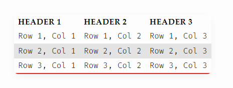

# Perfect Tables

**Perfect Tables** is a CSS snippet for Obsidian that enhances the appearance and readability of standard markdown tables. It provides a modern, clean look with features like zebra striping, hover effects, and improved header styling.

## Features

- Full-width tables for better use of space
- Rounded corners and subtle box shadows
- Stylish headers with accent colors
- Zebra-striping for easy row distinction
- Hover effect to highlight rows
- Improved separation between rows

## Installation

1. Download or copy the `perfect-tables.css` file into your Obsidian vault's `.obsidian/snippets` folder.
2. In Obsidian, go to **Settings → Appearance → CSS Snippets**.
3. Enable the **Perfect Tables** snippet.

## Example

See `image.png` for a preview of the table styling.

## Customization

You can further tweak colors and spacing by editing the CSS variables or styles in `perfect-tables.css`.
